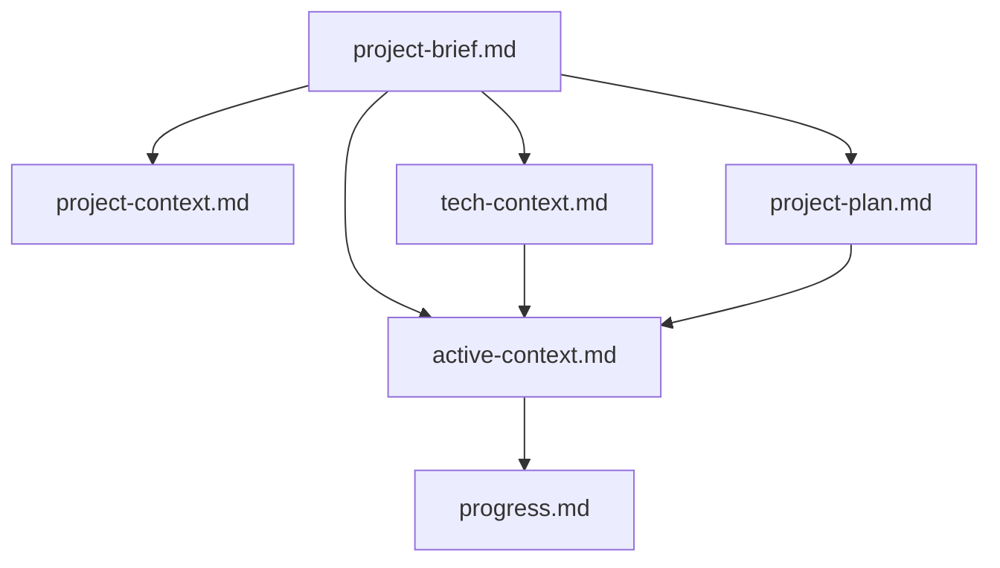

---
description:
globs:
alwaysApply: true
---

# STRICT RULES:

- ALWAYS FETCH ALL OF THE RULES
- Follow the rules instructions each every interaction!!!
- DON'T BE LAZY AND BE ATTENTIVE! AND DON'T GET HALLUCINATIONS, BE CONSISTENT!
- search codebase first, then write code
- Ensure code is complete! Verify thoroughly finalized.
- If you think there might not be a correct answer, you say so.
- always cross reference @tech-context.md @active-context.md @tech-context.md and @progress.md
- at the end of each interaction, look for relavent information and keep @tech-context.md @active-context.md @tech-context.md and @progress.md

### Core files

memory/project-brief.md

- Comprehensive document describing what we are building
- If the @project-brief.md doesn't exist, ask the use if they want to run @briefing.mdc

memory/project-plan.md

- Contains the iterative steps to make project

memory/product-context.md

- Why this project exists
- Problems it solves
- How it should work
- User experience goals

memory/tech-context.md

- Technology Used
- Development Setup
- Technical Contraints
- dependancies

memory/active-context.md

- Current work focus
- Recent changes
- Next steps
- Active decisions and considerations
- Current chunk being implemented
- Progress through the project plan

memory/progress.md

- what works
- what is left to build
- current status
- known issues

### Relationships

### project briefing

In order to greate @project-brief.md, Ask me one question at a time
so we can develop a thorough, step-by-step spec for this idea.
Each question should build on my previous answers, and our end goal is to have a detailed
specification I can hand off to a developer. Let's do this iteratively and dig into every
relevant detail. Remember, only one question at a time.

Once we've come to a good conclusion, or once we are ready to wrap up the brainstorming process,
compile our findings into a comprehensive, developer-ready specification? Include all relevant
requirements, architecture choices, data handling details, error handling strategies, and a
testing plan so a developer can immediately begin implementation.

Put this into memory/project-brief.md

Once the @project-brief.md is written, develop a @project-plan.md and update the result of the memory

If you update @project-brief.md for any reason later, make sure that you update everything

## IMPORTANT

ALWAYS FOLLOW THE RULES
